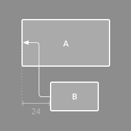
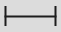

# Build a Responsive UI with ConstraintLayout

---

ConstraintLayout 可以**不用嵌套布局**就可以创建复杂的布局。和 RelativeLayout 类似，所有的 view 都是通过和其余的 view 以及 parent 建立联系来布局的。ConstraintLayout 比 RelativeLayout 更加灵活，而且我们可以通过 Android Studio 自带的 **Layout Editor** 来拖控件进行布局来代替写 XML 文件。

## 一. Requirement    

> + Android 2.3 (API level 9) and higher
> - Android Studio 2.2 and higher

## 二. Add ConstraintLayout to your project
检查是否安装了最新的 ConstraintLayout 库：    
1.  点击 `Tools > Android > SDK Manager`
2.  点击 `SDK Tools` 标签
3.  展开 `Support Repository` ，勾选`ConstraintLayout for Android` 和 `Solver for ConstraintLayout`进行下载，下载时请注意版本号，因为下面有用到，我的是1.0.1。
4. 在 build.gradle 中添加依赖：`compile 'com.android.support.constraint:constraint-layout:1.0.1'`

## 三. Getting start    
### Convert a layout
你可以按照下面的步骤将已存在的布局转化为 ConstraintLayout ：    
1. 打开现有布局，切换到 `Design` 标签
2. 看到`Component Tree`，然后右击你的 layout ，选择`Convert ××Layout to ConstraintLayout`

### Create a new layout
你可以直接创建一个 LayoutResourceFile 来创建ConstraintLayout，也可以按照下面的步骤：    
1. 在项目的任意位置右击选择`File > New > XML > Layout XML`
2. 输入 xml 文件名以及根布局`android.support.constraint.ConstraintLayout`

**note:** 第二步可以直接输入 `ConstraintLayout`，finish 后它会有异常提示，点击提示即可。    

---

### Add a constraint
你可以从`Palette` 中将控件拖到编辑器中，该控件会有一些约束句柄（即小圆点）供你拖动来与其余的 view 建立约束条件。     
 
创建约束条件需要遵守下列原则：
> + 每个 view 至少有2个约束条件：水平和垂直的约束。
> - 你只能在同一个平面上的约束句柄和锚点（即另一个 view 的边缘）之间建立约束。即一个 view 的 left/right 只能与另一个 view 的 left/right 边建立约束，而不能与 top/bottom 边建立联系。
> + 一个约束句柄只能用作一个约束，但你可以创建多个约束到同一个锚点上。

如要移除约束的话，可以选中该控件，点击一下该约束的约束句柄（即小圆点），约束即解除封印了。    
如果你给一个 view 的两边（上下或者左右）都设置了约束的话，约束的 line 会被扳弯成螺丝状。    

你可以使用约束来建立不同类型的布局，如下所示： 

  

  
 

  

  

### Adjust the constraint bias
 当你给 view 的两侧都加上了限制的话，默认 view 会在两个约束之间居中（即50%的偏移），如果你想修改这个偏移量的话，可以移动右侧`Properties` 面板中的滑块（可以通过鼠标拖动，也可以选中后通过键盘上的方向键调整）

### Adjust the view size
调整 view 的 size 的话，你可以拖动 view 的四个角来调整，但是这种调整不灵活，因为它会生成一个值来限定 view 的大小，不利于适配等。我们可以通过点击右边的`property` 面板上的 symbols 来修改 width 和 height。    

> + : Wrap Content。
> - : Match Constraints。和 Match Parent 类似（在 ConstraintLayout 中没有 Match Parent，Properties 面板中会有这个选项，设置 Match Parent 后，xml 中显示的是0dp，即 Match Constraints），不同的是它是用来适应 Constraints 而不是 parent。譬如你给 view 的左边设置 margin 为7，右边 margin 为10, 则 view 的 width 会自动适应这两个 margin。
> * : Fixed。即指定具体的值。

### Set size as a ratio
如果你将 view 的至少一个维度设置为 Match Constraints (0dp)，你就可以设置 view 的长宽比例了。   
使用方法：点击 view 的左上角，就会出现一个输入框让你输入比例。    
如果 horizontal 和 vertical 都是 Match Constraints 的话，可以点击左上角的三角形`Toggle Aspect Ratio Constraint` 来切换（点击后会有两边加粗，加粗的边的size就会被定死，另一条边进行 resize）

 
**note:** 该功能在 Android Studio 2.2.3 上还不支持，我更新到2.3后才支持，坑跌。另外若出现设置水平或垂直的轴为 Match Constraints，另一轴为固定值时，设置比例却不生效，你要检查下本应 resize 的轴的边是否”加粗“了，加粗了的话就相当于被定死大小了，要点击小三角来切换下。

---
### Dealing with View.GONE
ConstraintLayout 中，将 Visibility 设置为 GONE 的话，实质是将这个 view 的 width，height 以及 margin 都压缩到0，但仍然参与布局。这时就会导致以该 view 作为锚点添加限制条件的其余的 view 的位置都会改变。我们可以通过`layout_goneMarginStart (…Top, …End, and …Bottom)` 来设置这个 view 不可见后的 margin。

### Chains
所谓的链就是通过双向位置约束来链接一系列的 views。由于 ConstraintLayout 类似 RelativeLayout ，所以当我们要处理像 LinearLayout 这种线性布局的话岂不是很麻烦？我们知道 LinearLayout 可以设置权重来让多个 view 均匀间隔，RelativeLayout 是做不到的，ConstraintLayout 提供的 Chains 来达到相同的效果，当然功能远不仅如此。    
 
链可以让你使用以下方式水平或垂直分布一组视图:
> + Spread：即让你的 views 均匀间隔，像 LinearLayout 那样。
> - Spread inside：两边的 view 设置约束，然后中间的 view 进行均匀分布。
> * Weighted：可以像 LinearLayout 那样设置权重。当将 width/height 设置为 0dp 后，可以通过`app:layout_constraintHorizontal_weight="2"` 来设置权重。
> + Packed：view 会被 pack 到一起。    

那么如何创建 Chains 呢？
1. 选中所有要被链接在一起的 view 
2. 右击任意一个 view 就会出现`Center Horizontally` 之类的选项（里面提供了很多方法，可以根据需要进行使用）来达到 LinearLayout 之类的效果

  
 
 
譬如你选中 A, B, C 三个 view，然后右键点击 A，选择 `Center Horizontally` 这时3个 view 水平方向上就会平分 parent 布局。然后再选中一个 view ，右击选择`Align Top Edges`，这时三个 view 的顶部就对齐了。    
 
**note**: 设置 Align Top Edges 发现会出现并没有对齐的情况，这是因为设置这个后，相当与 C 和 B 的顶部对齐，B 和 A 的顶部对齐。如果你设置了 A 的 marginTop，B 和 C 不用设置就会与 A 的顶部对齐；但是你如果不设置 A，设置 B 的 marginTop 的话，那么 A 就会跑到顶部去，而 B 和 C 是对齐的。    

### Using Spaces for negative margins
ConstraintLayout 不支持设置负边距，但是我们可以通过`Space` 来变相处理。它其实是一个空的 view。将这个 view 的 size 作为负边距，然后将另一个 view 跟这个 view 对齐就行了。

### When to use Inference
当你点击 toolbar 上的`Infer constraints` 命令（就是上面黄色的 bling bling 的星星），它会将你缺少的约束给添加进去，譬如上面我添加了3个 view 水平方向是平分的，顶部对齐，但是没有设置垂直方向的 margin 之类的。虽然在编辑器中看到的位置是正常的，但是运行到手机上后会跑到屏幕上方。这时如果我们点击这个按钮的话，它会根据当前 view 在屏幕上的位置为我们生成一个垂直方向的约束，但很多情况下往往不是我们想要的（譬如本应该设置 marginTop，它却设置的是 marginBottom）。个人建议时你将 view 拖到编辑器后，适当的调整下位置后，使用这个帮你补全，然后再去检查一遍。

### Adjust the view margins
当我们给 view 建立约束时，这个约束的间距默认为8dp。我们可以通过点击 toolbar 上的 `8` 进行修改。

---
## 现在我们可以愉快的做一个拖控件的程序员了
