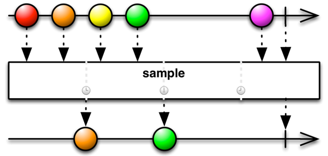

# RxJava 并发之数据流发射速度过快

标签： `RxJava`

---

##Backpressure
RxJava中，Observable相当于生产者，Subscriber相当于消费者。如果生产者的发射速度要比消费者的处理速度要快会出现什么情况呢？当然，在同步操作中，这不是一个问题：
```Java
// Produce
Observable<Integer> producer = Observable.create(o -> {
    o.onNext(1);
    o.onNext(2);
    o.onCompleted();
});
// Consume
producer.subscribe(i -> {
    try {
        Thread.sleep(1000);
        System.out.println(i);
    } catch (Exception e) { }
});
```
明显看出消费者的处理速度比生产者要慢，由于是同步操作，onNext(1)执行完后，会阻塞到消费者执行完才执行onNext(2).
那如果是异步会出现什么情况呢？
传统的**pull模型**中：生产者比较慢的话，消费者会阻塞等待；消费者慢，则生产者会阻塞到消费者处理完再生产。    
而RxJava是**push模型**，只要生产者数据好了就发射出去，不会等待消费者处理完。这会导致一个问题：
```Java
Observable.interval(1, TimeUnit.MILLISECONDS)
    .observeOn(Schedulers.newThread())
    .subscribe(
        i -> {
            System.out.println(i);
            try {
                Thread.sleep(100);
            } catch (Exception e) { }
        },
        System.out::println);
 

结果：
0
1
rx.exceptions.MissingBackpressureException
```
**rx.exceptions.MissingBackpressureException**这个异常就告诉我们生产者太快了，操作符无法处理这种情况。

-------------
##消费者的补救措施
###通过操作符过滤数据
> + Sample

用来过滤出一段时间间隔内发射的**最近的数据**，其余的丢掉


```Java
Observable.interval(1, TimeUnit.MILLISECONDS)
    .observeOn(Schedulers.newThread())
    .sample(100, TimeUnit.MILLISECONDS)
    .subscribe(
        i -> {
            System.out.println(i);
            try {
                Thread.sleep(100);
            } catch (Exception e) { }
        },
        System.out::println);
 

结果：

82
182
283
...
```

> + ThrottleFirst

用来过滤出一段时间间隔内发射的**第一条数据**，其余的丢掉

throttle 和Debounce 也能实现类似的效果
http://reactivex.io/documentation/operators/sample.html

> - collect

如果不想丢掉数据，当消费者忙的时候可以用buffer和window操作符来收集数据。
```Java
Observable.interval(10, TimeUnit.MILLISECONDS)
    .observeOn(Schedulers.newThread())
    .buffer(100, TimeUnit.MILLISECONDS)
    .subscribe(
        i -> {
            System.out.println(i);
            try {
                Thread.sleep(100);
            } catch (Exception e) { }
        },
        System.out::println);
 

结果：

[0, 1, 2, 3, 4, 5, 6, 7]
[8, 9, 10, 11, 12, 13, 14, 15, 16, 17]
[18, 19, 20, 21, 22, 23, 24, 25, 26, 27]
...
```

##Reactive Pull
　　上面的方式有时可以解决一些问题，但并不是最好的方式。因为都是采用缓存一段时间来处理的，但你仍然不知道这段时间内消费者处理的速度是否要比你缓存的时间快。有时候在生产者那里处理也是一种最好的方式。**Backpressure**是一种在生产者端降发射速度的方式。    
　　RxJava实现了一种通过Subscriber通知Observable发射数据的方式。Subscriber有个函数**request(n)**。调用该函数来通知Observable 现在Subscriber准备接收下面n个数据了。在Subscriber的onStart中调用request则开启了reactive pull backpressure。这并不是传统的Pull模型，并不会阻塞调用，只是Subscriber通知Observable当前Subscriber的处理能力。通过调用request可以发射更多的数据。
```Java
class MySubscriber extends Subscriber<T> {
    @Override
    public void onStart() {
      request(1);
    }
 
    @Override
    public void onCompleted() {
        ...
    }
 
    @Override
    public void onError(Throwable e) {
        ...
    }
 
    @Override
    public void onNext(T n) {
        ...
        request(1);
    }
}
```
在start中使用request(1)即开启backpressure模式，告诉Observable一次只发射一个数据。在onNext里面处理完该数据后，可以请求下一条数据。通过 quest(Long.MAX_VALUE) 可以取消 backpressure 模式。

> + doOnRequested

我们知道doOnComplete之类的方法，我们看一下其中的doOnRequest方法：
`public final Observable<T> doOnRequest(Action1<java.lang.Long> onRequest)`。当Subscriber请求更多的时候，doOnRequest会被调用。参数中的值为请求的数量。只有当一个 Subscriber 实现了 backpressure 的时候，Subscribe 才能使用该功能。下面是一个在外部实现 控制backpressure 的示例：
```Java


public class ControlledPullSubscriber<T> extends Subscriber<T> {
 
    private final Action1<T> onNextAction;
    private final Action1<Throwable> onErrorAction;
    private final Action0 onCompletedAction;
 
    public ControlledPullSubscriber(
            Action1<T> onNextAction,
            Action1<Throwable> onErrorAction,
            Action0 onCompletedAction) {
        this.onNextAction = onNextAction;
        this.onErrorAction = onErrorAction;
        this.onCompletedAction = onCompletedAction;
    }
 
    public ControlledPullSubscriber(
            Action1<T> onNextAction,
            Action1<Throwable> onErrorAction) {
        this(onNextAction, onErrorAction, () -> {});
    }
 
    public ControlledPullSubscriber(Action1<T> onNextAction) {
        this(onNextAction, e -> {}, () -> {});
    }
 
    @Override
    public void onStart() {
      request(0);
    }
 
    @Override
    public void onCompleted() {
        onCompletedAction.call();
    }
 
    @Override
    public void onError(Throwable e) {
        onErrorAction.call(e);
    }
 
    @Override
    public void onNext(T t) {
        onNextAction.call(t);
    }
 
    public void requestMore(int n) {
        request(n);
    }
}
 

上面的实现中，如果不主动调用 requestMore 函数，则 Observable 是不会发射数据的。

ControlledPullSubscriber<Integer> puller = 
        new ControlledPullSubscriber<Integer>(System.out::println);
 
Observable.range(0, 3)
    .doOnRequest(i -> System.out.println("Requested " + i))
    .subscribe(puller);
 
puller.requestMore(2);
puller.requestMore(1);
 

结果：

Requested 0
Requested 2
0
1
Requested 1
2
```
ControlledPullSubscriber 在onStart 中告诉 Observable 先不要发射数据。然后我们分别请求 2个数据和1 个数据。    

Rxjava内部采用队列和缓冲来实现backpressure从而避免无限量的保存数据。大量数据的缓冲应该采用相应的操作符来处理，如cache,buffer等。zip函数就是一个示例。第一个Observable可能在第二个Observable发射数据之前就发射了一个或多个数据，所以zip需要一个较小的缓冲来匹配两个Observable从而避免操作失败。**zip内部使用的是128个数据的小缓冲**。
```Java
Observable.range(0, 300)
    .doOnRequest(i -> System.out.println("Requested " + i))
    .zipWith(
            Observable.range(10, 300),  //将2个Observable结合在一起并通过后面的action进行操作
            (i1, i2) -> i1 + " - " + i2)
    .take(300)
    .subscribe();

结果：
Requested 128
Requested 90
Requested 90
Requested 90
```
zip操作符首先请求足够的（128个)数据来填充缓存。在Rx中，不管开发者有没有主动启用该功能，有些操作函数内部会使用该功能，这样可以保证rx数据流更加稳定可扩展。

-----------------------
##Backpressure策略
很多Rx操作符内部使用了backpressure从而避免过多的数据填满内部的队列。这样处理慢的消费者会把这种情况传递给前面的消费者，前面的消费者开始缓冲数据，直到它也缓存满再告诉它前面的消费者。Backpressure并没有消除这种情况，只是延迟了这种情况发生。Rx还是有操作符用来处理这种消费者处理不过来的情况。

> + onBackpressureBuffer

它会缓存所有当前无法处理的数据，直到Observer可以处理为止。你可以指定缓冲的数量，如果缓冲满了会导致数据流失败。


```Java
Observable.interval(1, TimeUnit.MILLISECONDS)
    .onBackpressureBuffer(1000)
    .observeOn(Schedulers.newThread())
    .subscribe(
        i -> {
            System.out.println(i);
            try {
                Thread.sleep(100);
            } catch (Exception e) { }
        },
        System.out::println
    );
    
结果：
0
1
2
3
4
5
6
7
8
9
10
11
rx.exceptions.MissingBackpressureException: Overflowedbufferof 1000
```

> + onBackpressureDrop

如果消费者无法处理数据，则 onBackpressureDrop 就把该数据丢弃了。
```Java
Observable.interval(1, TimeUnit.MILLISECONDS)
    .onBackpressureDrop()
    .observeOn(Schedulers.newThread())
    .subscribe(
        i -> {
            System.out.println(i);
            try {
                Thread.sleep(100);
            } catch (Exception e) { }
        },
        System.out::println);
 

结果：

0
1
...
126
127
12861
12862
...
```
前面128个数据正常处理了，因为observeOn在切换线程的时候使用了一个128个数据的小缓存。
